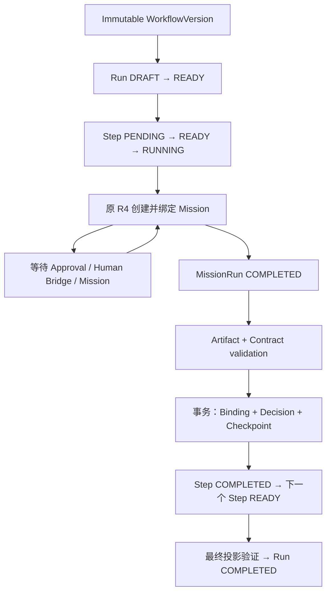

# W3.2 — Import Existing Work + State Resolver + Resume

冻结基线：`main@d106185de21b4a4e988b03e08d69d7f4d0e84cf3`。仅 W3.2，不进入 R6。

## 现有生命周期审计

- StepRun 在创建时只能 PENDING、无 Mission；首次绑定身份 immutable，Mission Retry 只能绑定同 Mission 的新 Run。
- 普通 TASK/REVIEW 的完成要求真实 terminal MissionRun、冻结 required output、有效 receipt、checkpoint；REVIEW 还要求结构化 verdict 与输入 lineage。DECISION 依赖 declared branch + checkpoint，没有模型执行。
- Artifact、Binding、Receipt、Decision、Checkpoint 和 Event append-only。旧 Artifact 强制真实 Mission/Run/actor，因此导入不能伪造这些身份来复用 INSERT。
- Retry 保留旧 attempt/Artifact；恢复不启动或重试 Mission。INTERRUPTED/UNKNOWN 保持明确用户动作，不能自动重放。

## Import 方案比较

扩展旧 Artifact 表需要改变其 NOT NULL Mission/actor 与既有外键；独立 Import fact 可以保持旧执行表及其 INSERT guard。本轮选择独立 Import provenance，通过 SQLite adapter 合并读取投影，继续复用 W1 orchestration。0032 显式保留 EXECUTED completion 防线，为 IMPORTED_CONFIRMED 建立独立确认/验证约束；不关闭 trigger/FK，不生成假的 Mission、Usage、Experience 或 Operation Receipt。

## 领域、持久化与权限

- 追加 `0032_w32_workflow_import.sql`，历史 0001–0031 不改。Proposal 支持 DRAFT / VALIDATED / CANCELLED / COMMITTED；CAS revision 防止旧映射覆盖新映射。确认、导入 Artifact / Binding / Validation / Lineage 均 append-only。
- StepRun 以 `completionOrigin` 区分 EXECUTED / IMPORTED_CONFIRMED。旧数据默认为 EXECUTED。导入 Artifact 的 Mission/Run/actor 为空，具有独立 confirmation/source 身份；普通 Artifact 表仍要求真实执行 provenance。
- 同一 Proposal 只能确认到一个全新 Run。Run 创建、确认、Proposal 提交、前缀状态机、输出/依赖绑定、PASS validation、声明边与 checkpoint 在同一 SQLite 事务内完成。失败回滚全部事实。
- Renderer 只发送版本、输入、描述和受限映射；源文件必须由 Main 原生选择器取得。Workspace canonical / symlink / 类型 / 大小 / UTF-8 / hash / 修改时间均检查，读取通过现有 ToolRuntime 的用户读取授权路径。确认前再次检查来源，读取不会新增 PermissionRule。
- 源内容保存本地有界快照，Renderer Proposal DTO 不包含绝对路径或文件正文。确认后的 TEXT/JSON 快照作为 bounded untrusted Artifact context，经原 W1/R4/Mission 继续执行，不产生新的文件读取权限。

## Resolver、验证与范围

- Resolver 完全离线：以冻结版本的 entry/声明单一 ALWAYS 后继、合法 Contract 和有界来源生成建议，支持用户手工修订映射。无 Jev/Cloud 推断，不要求 API Key；confidence 不能代替 validator 或确认。
- 每次修订重新验证 frozen version/hash、连续可达前缀、required dependency/output、类型/hash/Contract、源文件唯一身份、映射与安全继续点。不能仅凭后续结果推定缺失前序完成。
- 本轮可导入个人工作流的 NONE / VALID_OUTPUTS / TEXT 或 JSON TASK 前缀；每步至少一个真实映射成果，保留至少一个后续步骤。REVIEW / DECISION、需要确认、生成执行或副作用步骤不能导入完成，随后仍按原引擎执行。
- 官方工作流仅支持 `official.research@1` 的 R01 brief 安全情境，并核对冻结 researchQuestion/field。其他官方复杂步骤明确显示暂不支持导入；不修改官方 Version、Graph、Contract 或 release hash。
- 每文件最多 64 KiB，最多 16 个来源；只支持 Workspace 内明确选择的 UTF-8 文本/JSON。目录、二进制、项目递归导入和在线 AI Resolver 未实现。

## 产品与恢复

- 已发布版本提供“导入已有工作”；复用现有 Drawer/Input Form/tokens，展示建议、来源、映射、缺失/错误、继续点和明确确认。版本/Hash/策略等技术事实放 Advanced。
- 可继续同版本未确认提案；恢复不会自动确认。用户取消不会创建 Run/Mission/Usage。
- 已确认历史显示外部成果/用户确认；后续步骤显示真实执行与 Mission。旧完成步骤不重跑，事务中退出回滚，事务后重启绑定同一个确认/Run。
- 副作用、UNKNOWN、Human Bridge、Permission/Approval 的恢复语义沿用原 W1/W2/R4；不能借导入伪造 PREPARED/APPLIED/VERIFIED 或重放不确定操作。

## 实施状态

完成 W3.2，等待审批。受影响回归 78 个文件、774 项通过；最后一轮原命令六项全部通过。以下 packaged 证据已由该成功轮重新生成。

## Packaged 验收矩阵

| 场景       | 已验证事实                                                                                               |
| ---------- | -------------------------------------------------------------------------------------------------------- |
| A 正常导入 | 原生文件选择、Renderer 手工核对与明确确认，创建正式 USER Run                                             |
| B 部分完成 | 4 步中前 2 步导入确认，后 2 步产生真实 Mission/Run/Usage/Audit                                           |
| C REVIEW   | 不认可未经证明的外部审核；实际 REVIEW 返回 PASS 与真实输入 Artifact ID                                   |
| D 无效资料 | 类型不匹配、hash 伪造、文件改变、超限、junction escape、缺失 required output 均拒绝                      |
| E 修订     | 修订后重新验证；非法前缀和跳过 REVIEW 不能创建 Run                                                       |
| F 取消     | 明确取消为 CANCELLED，无 Run/Artifact/Mission/Usage/权限事实增加                                         |
| G 重复确认 | 同 Proposal 返回同 Run，所有正式事实计数不变                                                             |
| H 重启     | 未确认保留；事务中硬退出零半提交；确认后/继续前/完成后不重放；执行中保持原 MissionRun 并进入等待用户处理 |
| I 官方     | research@1 的 R01 brief 合同与冻结问题/领域一致；副作用和复杂官方节点不能导入完成                        |
| J 版本     | v1 Proposal 期间发布 v2，确认仍绑定原 v1/hash                                                            |
| K 安全     | 确认不生成 Permission、Approval、Mission、Usage 或 Experience；源内容作为 untrusted data                 |

`packaged/acceptance.json` 与 `packaged/rawfacts.json` 保留独立事实及断言。1440 / 1180 / 900 名义窗口尺寸覆盖提案、确认历史、实际审核、完成/重启页面；900 在 Windows DPI 下实际 CSS viewport 为 902，document 宽度不溢出。截图均来自 Windows packaged app，使用离线合成数据。

## 兼容性补充

旧 schema 的 EXECUTED adapter 路径保留，0032 之前不存在的导入字段/表不参与读取；导入完成仍明确要求 0032，不能借兼容分支绕过 guard。历史迁移升级测试、旧 Run pin、官方 hash 和旧 EXECUTED 完成强度均回归。关闭 Drawer 保留可恢复提案；明确“取消导入”才写入 CANCELLED，不能用旧 revision 覆盖新的提案。

## 最终验证证据

| 原命令                  | 结果                     | 日志                           |
| ----------------------- | ------------------------ | ------------------------------ |
| `npm run test`          | PASS，153 文件 / 1375 项 | `validation/test.txt`          |
| `npm run typecheck`     | PASS                     | `validation/typecheck.txt`     |
| `npm run lint`          | PASS                     | `validation/lint.txt`          |
| `npm run format:check`  | PASS                     | `validation/format-check.txt`  |
| `npm run package`       | PASS，Windows x64        | `validation/package.txt`       |
| `npm run smoke:package` | PASS，全链路与 W3.2 A–K  | `validation/smoke-package.txt` |

证据目录：`docs/evidence/w3-2-import-existing-work/`。`acceptance.json` 记录六项原命令、日志 hash、migration、范围与最终截图；`build-source-manifest.json` 验证 505 个构建输入与物理构建镜像完全一致。复用项目内 `.tmp/g3-verify` 镜像隔离 Node 测试与 Electron native ABI，镜像中执行原 `npm run package`；无临时 NODE_OPTIONS preload。缓存、profile 和新文件均位于项目 E 盘目录。

完整 smoke 保持 Gate 0–6、R0–R5、W1/W2、G1–G3、W3.1 的权限、Identity、Memory、Human Bridge、UNKNOWN 零重放与 frozen package 回归。W3.1 本轮事实另归档到 `compatibility/w31-packaged-facts.json`，旧审批截图保持原样。只有追加 0032，没有新依赖。

验收中的旧 migration 数量断言与格式问题已修正，并从 `npm run test` 重启全部六项；正式日志只保留最后完整成功轮。生成的历史原始 facts 作为不可改写的验收数据排除文本格式检查，新 W3.2 JSON 按仓库 Prettier 配置输出。

## 官方 frozen hashes

| 官方 v1      | Content hash                                                       | Manifest hash                                                      |
| ------------ | ------------------------------------------------------------------ | ------------------------------------------------------------------ |
| AI 资讯视频  | `4763d276b85362096db1085ebc458c76ea731c243d72df6069da302ca75ce153` | `ae37a04bf0156c42adea41d8d0418de2f942d6dc677803727af7db41ab36e4cd` |
| 软件功能开发 | `a5a9982824db796dc4843d68558b4874067d551eff878132c78c94e881e2ea5a` | `30eb30ce957ef3bad798d1046bd45835322b645d97e49ca5affcac4e16cd348d` |
| 科研         | `b264c0448470b12473c0e39f21cf7e1c40c1d9b4b6e1c945f9ffb5ccc2a305b7` | `199c675c91c1c7d15709141be9a7dc6ce1e776f3c1b0af7c66c2ff9e1f3b03d3` |

本轮未实现在线 AI Resolver、目录/二进制/递归项目导入、复杂官方效果步骤导入，未进入 R6。H3 live endpoint 联调仍不是本轮离线验收内容，未伪造 live 证据。
